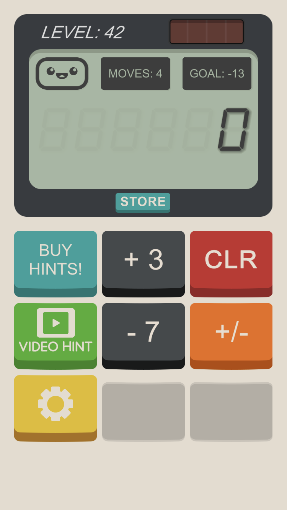
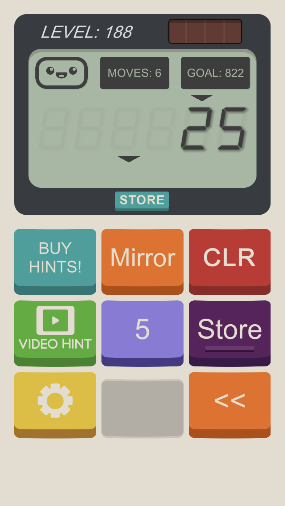
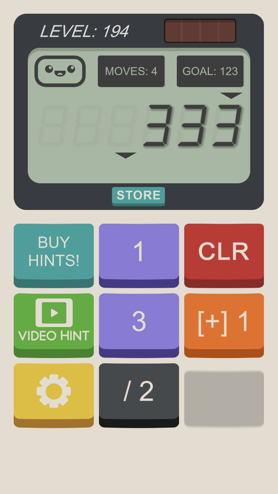

# calculator_the_game_solver.hs

A haskell solver for [*Calculator The Game*](https://apps.apple.com/us/app/calculator-the-game/id1243055750)

- [calculator_the_game_solver.hs](#calculator_the_game_solverhs)
  - [Gallery](#gallery)
    - [LEVEL: 42](#level-42)
    - [LEVEL: 155](#level-155)
    - [LEVEL: 188](#level-188)
    - [LEVEL: 194](#level-194)
  - [API](#api)
    - [Parameters](#parameters)
    - [`Op`erations](#operations)
    - [Notes](#notes)

## Gallery

### LEVEL: 42



```hs
import           CalculatorTheG

main :: IO ()
main =
    let v0      = 0
        goal    = -13
        nbMoves = 4
        ops     = [Add 3, Sub 7, Neg]
        f       = id
    in  putStrLn $ showSolution v0 goal nbMoves ops f
```

```console
$ ghc solver && ./solver
+3 -> +3 -> +/- -> -7
```

### LEVEL: 155

 93, /3, Store, 31 => 00"
    src="gallery_assets/lvl_155.PNG"
    width="256"
/>

```hs
import           CalculatorTheG

main :: IO ()
main =
    let
        v0      = 9
        goal    = 3001
        nbMoves = 9
        ops =
            [Replace "39" "93", Div 3, StoreNew, StoreInsert, Replace "31" "00"]
        f = id
    in
        putStrLn $ showSolution v0 goal nbMoves ops f
```

```console
$ ghc solver && ./solver
Store(new) -> /3 -> Store(Ins) -> 39=>93 -> Store(new) -> Store(Ins) -> 39=>93 -> /3 -> 31=>00
```

### LEVEL: 188



```hs
import           CalculatorTheG

main :: IO ()
main =
    let v0      = 25
        goal    = 822
        nbMoves = 6
        ops     = [Mirror, Ins "5", StoreNew, StoreInsert, Delete]
        f       = portal 3 1
    in  putStrLn $ showSolution v0 goal nbMoves ops f
```

```console
$ ghc solver && ./solver
5 -> Mirror -> Store(new) -> Store(Ins)
```

### LEVEL: 194



```hs
import           CalculatorTheG

main :: IO ()
main =
    let v0      = 333
        goal    = 123
        nbMoves = 4
        ops     = [Ins "1", Ins "3", Div 2, IncrementButtonValues 1]
        f       = portal 3 0
    in  putStrLn $ showSolution v0 goal nbMoves ops f
```

```console
$ ghc solver && ./solver
3 -> [+]1 -> /3 -> 2
```

## API

To compute the (shortest) sequence of operations that beats a level, fill in the `???`s below in `solver.hs`:

```hs
import           CalculatorTheG

main :: IO ()
main =
    let v0      = ???
        goal    = ???
        nbMoves = ???
        ops     = ???
        f       = ???
    in  putStrLn $ showSolution v0 goal nbMoves ops f

```

### Parameters

| Parameter | Type         | Description                                                               | Example value(s)                                                                                                                   |
| --------- | ------------ | ------------------------------------------------------------------------- | ---------------------------------------------------------------------------------------------------------------------------------- |
| `v0`      | `Int`        | Initial value                                                             | `-42`                                                                                                                              |
| `goal`    | `Int`        | Target value                                                              | `520`                                                                                                                              |
| `nbMoves` | `Int`        | Maximum number of moves allowed                                           | `4`                                                                                                                                |
| `ops`     | `[Op]`       | List of possible operations represented by the buttons                    | `[Add 1, Sum, Mirror]` - see the complete list of `Op` values below                                                                |
| `f`       | `Int -> Int` | Function applied after an operation is completed. Used to handle portals. | `id` - no portals; `portal 3 0` - pipes the 4th digit (index 3) from the right to the rightmost digit (index 0), e.g., 1234 -> 235 |

### `Op`erations

| Constructor                 | Example                   | Corresponding button label                     | Effect of said button                                                                                                                                 |
| --------------------------- | ------------------------- | ---------------------------------------------- | ----------------------------------------------------------------------------------------------------------------------------------------------------- |
| `Add Int`                   | `Add 1`                   | `+ 1`                                          | 6 -> 7                                                                                                                                                |
| `Sub Int`                   | `Sub 1`                   | `- 1`                                          | 44 -> 43                                                                                                                                              |
| `Mul Int`                   | `Mul 2`                   | `× 2`                                          | 32 -> 64                                                                                                                                              |
| `Div Int`                   | `Div 2`                   | `/ 2`                                          | 20 -> 10 (only if the division yields an integer)                                                                                                     |
| `Square`                    | `Square`                  | `x^2`                                          | -2 -> 4                                                                                                                                               |
| `Cube`                      | `Cube`                    | `x^3`                                          | -3 -> -81                                                                                                                                             |
| `Ins String`                | `Ins "1"`                 | `1`                                            | 7 -> 71                                                                                                                                               |
| `Neg`                       | `Neg`                     | `Neg`                                          | 1 -> -1                                                                                                                                               |
| `Sum`                       | `Sum`                     | `Sum`                                          | 123 -> 6                                                                                                                                              |
| `Reverse`                   | `Reverse`                 | `Reverse`                                      | 69 -> 96                                                                                                                                              |
| `Replace String String`     | `Replace "31" "00"`       | `31 => 00`                                     | 3311 -> 3001                                                                                                                                          |
| `Delete`                    | `Delete`                  | `<<`                                           | 31 -> 3                                                                                                                                               |
| `ShiftR`                    | `ShiftR`                  | `Shift >`                                      | 125 -> 512                                                                                                                                            |
| `ShiftL`                    | `ShiftL`                  | `Shift <`                                      | 125 -> 251                                                                                                                                            |
| `Inv10`                     | `Inv10`                   | `Inv10`                                        | 12590 -> 98510                                                                                                                                        |
| `Mirror`                    | `Mirror`                  | `Mirror`                                       | 123 -> 123321                                                                                                                                         |
| `StoreNew`                  | `StoreNew`                | `Store` (long press)                           | 99 -> 99 and the number 99 is stored, allowing you to insert the number 99 by pressing the store button (only if the number to be stored is positive) |
| `StoreInsert`               | `StoreInsert`             | 99 (after storing this number with `StoreNew`) | 6 -> 699                                                                                                                                              |
| `IncrementButtonValues Int` | `IncrementButtonValues 1` | `[+] 1`                                        | 16 -> 16, but the values of other buttons are incremented by 1; e.g., `Add 1` -> `Add 2`                                                              |

### Notes

- `[+] 1` interacts with `Add`, `Sub`, `Mul`, `Div`, `Ins`(, `StoreInsert` and `Replace`).

- `Insert` and `Replace` only take string representations of non-negative integers as argument(s).
